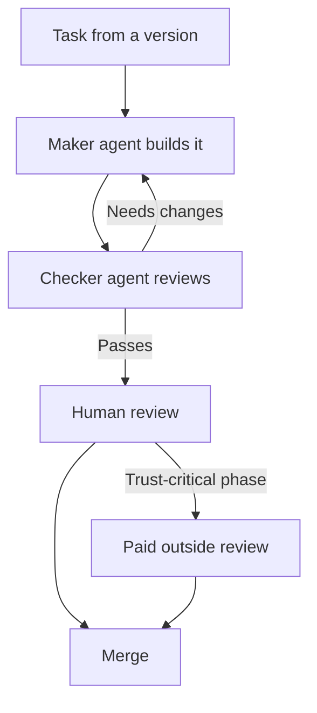

# Implementation plan

## Overview

This plan treats the 25 versions in this roadmap as a backlog worked by a small set of specialized AI agents, instead of one person doing every task in order. Each agent has one job. A "maker" agent builds something; a "checker" agent doesn't build anything, it only verifies the maker's work against that version's acceptance criteria (the ones already written earlier in this doc) before anything reaches the human for final review.

The point of this split is speed without losing quality: several maker agents can work on independent pieces of a version, or on different versions in the same phase, at the same time — but nothing gets merged without passing its checker first. The human stays the final approver throughout, and takes on extra weight specifically at the two trust-critical phases (GitHub write access and enterprise governance), where an outside paid review sits on top of the checker agent's work, matching the cost tab.

## The agent roster

| Agent | Type | What it does | Reports to |
| --- | --- | --- | --- |
| Frontend Engineer Agent | Maker | Builds UI features: the manager shell, browsing views, the composition canvas, controls, styling with Tailwind and shadcn/ui | Checker Agent, then human |
| Backend Engineer Agent | Maker | Builds the API, database schema, background jobs, and general integrations (notifications, analytics, LLM calls) | Checker Agent, then human |
| Integration Specialist Agent | Maker | Handles the highest-risk external integrations specifically: the GitHub App and permissions, the Figma publish/drift pipeline, SSO | Checker Agent and Security Reviewer Agent |
| Docs and Guidance Agent | Maker | Writes the per-component guidance blocks, the project-level guidance file, and user-facing docs | Checker Agent |
| Release Agent | Maker | Handles CI pipeline config, Docker packaging, versioning, release notes, and the recurring fork-sync check against upstream Storybook | Checker Agent |
| QA / Checker Agent | Checker | Reviews every maker agent's output against that version's acceptance criteria; runs and writes tests; never edits features itself, only verifies and reports back | Human |
| Security Reviewer Agent | Checker, elevated | Extra scrutiny specifically for phase 8 (write access) and phase 10 (SSO/governance): checks permission scopes and auth flows, and flags what a human or paid outside reviewer should look at | Human, plus the paid outside review from the cost tab |

## How the agents work together

Every task traces back to one version's acceptance criteria in this doc, and follows the same loop regardless of which maker agent is doing the work:

Parallel work happens by running more than one maker agent at once, each on its own git branch, on tasks that don't depend on each other — for example, the import wizard (v3) and the token importer (v4) touch different code and can be built at the same time. A checker agent still reviews each branch separately before anything merges; parallel work speeds up building, not verifying.

## One-time human setup, before v1 starts

- [ ] Create the GitHub organization and the main repository the fork will live in
- [ ] Set up a Claude subscription (Pro to start; see the cost tab for when to step up to Max)
- [ ] Choose a hosting provider account for later deployments (free tier is fine to start)
- [ ] Choose a database and object storage provider (free tier to start)
- [ ] Register a domain, if you want one from day one
- [ ] Set up a password manager or secrets vault — you'll be collecting several API keys across the roadmap and they shouldn't live in plain text files
- [ ] Decide where agent definitions will live in the repo (for example, one markdown file per agent role) so every maker and checker agent has a stable, version-controlled brief to work from

## Ongoing, cross-cutting tasks (not tied to one version)

A few things don't belong to a single version because they run continuously once started:

- **Fork sync (Release Agent, recurring):** on a monthly cadence, or whenever Storybook ships a security release, diff the fork's manager, preview, and channel code against upstream and flag anything relevant for human review. This starts the moment v1 ships, not later.
- **Checking the checker (human, recurring):** keep a small set of known-bad cases — an intentionally broken permission check, an accessibility violation, a hardcoded token — and periodically re-run them against the Checker and Security Reviewer Agents to confirm they still catch what they're supposed to. Also spot-check a random sample of already-passed work, especially in the first few phases, before trusting the pattern.
- **Observability (Backend and Release Agent, built in v2, then ongoing):** error tracking, logging, and uptime monitoring are part of v2's acceptance criteria, not an afterthought — keep them wired in as new services get added in later phases, not just at launch.

## Phase 1 (v1–v2): Foundation

Agent tasks:

- Frontend Engineer Agent: fork Storybook's manager, preview, and channel; wire up the existing builders and docgen packages unchanged (v1)
- Release Agent: build the Docker image and one-command install script (v2) — can start once v1's repo structure exists, in parallel with the rest of v1's polish work

Checker focus:

- Confirms an existing CSF story set renders identically to vanilla Storybook
- Confirms at least 3 existing addons load unmodified
- Confirms the smoke-test suite passes and a fresh install completes in under 10 minutes

Human tasks:

- Approve the repo structure and branch strategy before agents start committing
- Nothing else new here beyond the one-time setup above

## Phase 2 (v3–v4): Get an existing library in fast

Agent tasks:

- Backend Engineer Agent: build the bulk docgen introspection and CSF auto-generation for the import wizard (v3)
- Backend Engineer Agent, second instance: build the token importer and theme decorator (v4) — can run in parallel with v3, different code paths

Checker focus:

- Runs the wizard against a real sample component library and confirms the 90% auto-generation bar
- Runs the token importer against a real token file and confirms the theme toggle works live, with no manual CSS
- Confirms unsupported formats fail with a specific, readable error rather than a silent skip

Human tasks:

- Provide (or point the agents to) a real existing component library and a real token file to test the import tools against
- Decide which token format to support first — plain JSON or Style Dictionary — since that's a product call, not something the agents should guess

## Phase 3 (v5–v7): Designer-friendly browsing

Agent tasks:

- Frontend Engineer Agent: build the designer-friendly browsing view and the code toggle (v5)
- Frontend Engineer Agent, second instance: build the "see every variant at a glance" view (v6) — can run in parallel with v5
- Frontend Engineer Agent: build global viewport and theme switching (v7), once v4's theming work exists

Checker focus:

- Confirms a non-engineer can find and open a component without knowing the file structure, and that the code toggle shows the exact source
- Confirms the variant view handles a 2-prop component correctly and loads in under 2 seconds
- Confirms viewport/theme state is shareable by URL

Human tasks:

- The roadmap deliberately leaves the exact layout and interaction pattern open — review and approve the actual visual direction before the Frontend Agent locks in the final version, rather than letting the agent decide alone

## Phase 4 (v8–v9): Guidance layer and first audit

Agent tasks:

- Docs and Guidance Agent: build the per-component guidance block structure and the project-level guidance markdown file (v8)
- Backend Engineer Agent, in parallel: wire up the axe-core scan inside the preview iframe and the results panel (v9)

Checker focus:

- Confirms guidance renders without a manual boilerplate step, and that the guidance file is plain, version-controlled markdown readable with no special tool
- Confirms every story is scanned automatically, failures link to the specific rule and element, and the false-positive rate is validated against a known test set

Human tasks:

- Write, or closely review, the first real version of the guidance file's actual conventions — naming rules, what's designer-editable — since this is a judgment call the agents shouldn't make unsupervised
- This is the natural point to treat the free tier as feature-complete and start planning the Pro launch

## Phase 5 (v10–v12): Collaboration

Agent tasks:

- Backend Engineer Agent: build comment storage and pinning to a specific rendered state (v10)
- Backend Engineer Agent, second instance: build the notification and subscription system (v11), once v10's data model exists
- Backend Engineer Agent, third instance: build the usage and adoption analytics pipeline (v12) — fully independent, can run alongside v10/v11

Checker focus:

- Confirms a comment survives an unrelated token or prop change instead of silently detaching
- Confirms a notification fires within 5 minutes of publish and includes a working diff link
- Confirms the adoption dashboard reflects real usage data from a connected repo, refreshed at least daily

Human tasks:

- Connect at least one real consuming repo so analytics (v12) has real data to test against
- Set up a transactional email or notification delivery service for v11
- Set up billing, since this is the point Pro tier starts being sold for real

## Phase 6 (v13–v16): Deeper audits and the Figma bridge

Agent tasks:

- Backend Engineer Agent: build the visual regression screenshot-diffing pipeline (v13) — parallel with v14
- Backend Engineer Agent, second instance: build the token-drift lint (v14) — parallel with v13
- Integration Specialist Agent: build the one-way Figma publish pipeline (v15), then the Figma drift detection on top of it (v16); v16 must follow v15

Checker focus:

- Confirms visual changes are flagged with an actual side-by-side diff, not just pass/fail, and false positives from font rendering stay under the agreed threshold
- Confirms the drift lint reports a file and line number, not a vague location
- Confirms the Figma publish pipeline never reads anything back from Figma into code
- Confirms drift alerts name the specific mismatch and run on a schedule

Human tasks:

- Create a Figma developer account and generate the API credentials the Integration Agent will use
- Provide a real Figma library file to test the one-way publish against
- Make the visual regression and drift checks required checks in CI, not optional ones

## Phase 7 (v17–v19): Low-code editor

Agent tasks:

- Frontend Engineer Agent: build the composition canvas (v17)
- Frontend Engineer Agent: build persistence and code export on top of it (v18) — depends on v17
- Frontend Engineer Agent, second instance, once v17 is stable: build the constrained visual prop and token editing UI (v19)

Checker focus:

- Confirms the canvas only ever uses real, existing components
- Confirms exported code compiles and renders identically to the canvas preview
- Confirms the schema constraint genuinely blocks any out-of-bounds edit, not just the ones the UI happens to hide

Human tasks:

- No new access needed — this phase mostly needs product judgment on what "good" composition and editing UX feels like, reviewed against real use rather than agent output alone

## Phase 8 (v20–v22): GitHub write access

Agent tasks:

- Integration Specialist Agent: build the CODEOWNERS-style permission map (v20)
- Integration Specialist Agent: build branch and PR automation on top of it (v21) — depends on v20
- Release Agent: build the CI review gate and the merge-triggered publish/rebuild (v22) — depends on v21

Checker focus, Security Reviewer Agent leads:

- Confirms permission enforcement happens server-side and can't be bypassed from the client
- Confirms every PR is attributed to a real git identity, never a shared bot account
- Confirms the CI gate actually blocks merge when a required audit fails, not just warns

Human tasks:

- Register a GitHub App for the product (never personal access tokens) and scope its requested permissions as narrowly as possible
- **Commission the paid outside security review from the cost tab before this phase ships for real** — this is the one place the agent checkers aren't enough on their own
- Decide and document exactly which files and paths are designer-editable before the permission map gets built, not after

## Phase 9 (v23–v24): AI agent

Agent tasks:

- Backend Engineer Agent: wire up the explain-and-draft agent (v23), grounded in the guidance file from v8
- Backend Engineer Agent: build prompt-to-composition and automated PR review (v24) — depends on the low-code editor (v17–v18) and the PR flow (v21) already existing

Checker focus:

- Confirms the in-product agent labels its output as a suggestion and never auto-applies a change
- Confirms prompt-generated compositions use only real components, never invented ones
- Confirms a human can see and override any automated PR review comment, and that the agent never blocks a merge on its own

Human tasks:

- Set up the LLM API key and billing this in-product agent will call server-side
- Decide the tone and personality of the in-product agent's messages — a product decision, not an engineering one

## Phase 10 (v25): Enterprise governance

Agent tasks:

- Integration Specialist Agent: build the SSO integration
- Backend Engineer Agent, in parallel: build the audit log
- Release Agent, in parallel: document and test the on-prem/VPC deployment path

Checker focus, Security Reviewer Agent leads:

- Confirms SSO works end to end with a real provider, not just against a mock
- Confirms every write action (edits, merges, permission changes) appears in an exportable audit log
- Confirms the on-prem deployment actually works on a clean environment, not only in documentation

Human tasks:

- Set up a real account with at least one SSO provider (Okta or Azure AD) to test against
- **Commission the second paid outside review from the cost tab here, before offering this to real enterprise customers**
- Decide the SLA terms you're actually comfortable committing to before advertising them

## Phase 11 (v26): Agent manifest and MCP server

Agent tasks:

- Backend Engineer Agent: build the manifest export (components, props, tokens, guidance text) from the existing catalog, token store, and guidance file
- Integration Specialist Agent, in parallel: build and host the live MCP server that exposes the same data to external coding agents

Checker focus:

- Confirms the manifest accurately reflects the real, current catalog and tokens, not a stale or partial copy
- Confirms a real external coding agent, connected via MCP, uses real component names and props in a test prompt rather than inventing them
- Confirms a component or variant currently failing an audit is excluded until it passes again
- Confirms a library change appears through the MCP server within a few minutes, with no manual step

Human tasks:

- Decide which coding agents to test the MCP integration against first (Cursor and Claude Code are the obvious starting pair)
- Set this phase's pricing and messaging, since it's likely the strongest single reason a team upgrades to Pro

## Running this in practice

- Define one Claude Code subagent per role in the roster above (a markdown file per agent, kept in the repo), each with a narrow, specific brief tied to one version's acceptance criteria — not "build the frontend," but "build v5 exactly as its acceptance criteria describe."
- Point each maker agent at its own git branch, so parallel work never collides before review.
- Run the checker agent against the diff for that specific branch, not the whole codebase from scratch, so its review stays focused and fast.
- For real concurrent work across separate sessions (not just separate branches), Claude Code has an experimental multi-session "agent teams" capability; treat it as optional and check current docs before relying on it, since experimental features change.
- Keep the human review step even when the checker agent passes, at least until you've built up trust in how a given kind of task turns out — and never skip it for phases 8 and 10, regardless of how many times the checker has passed similar work before.
